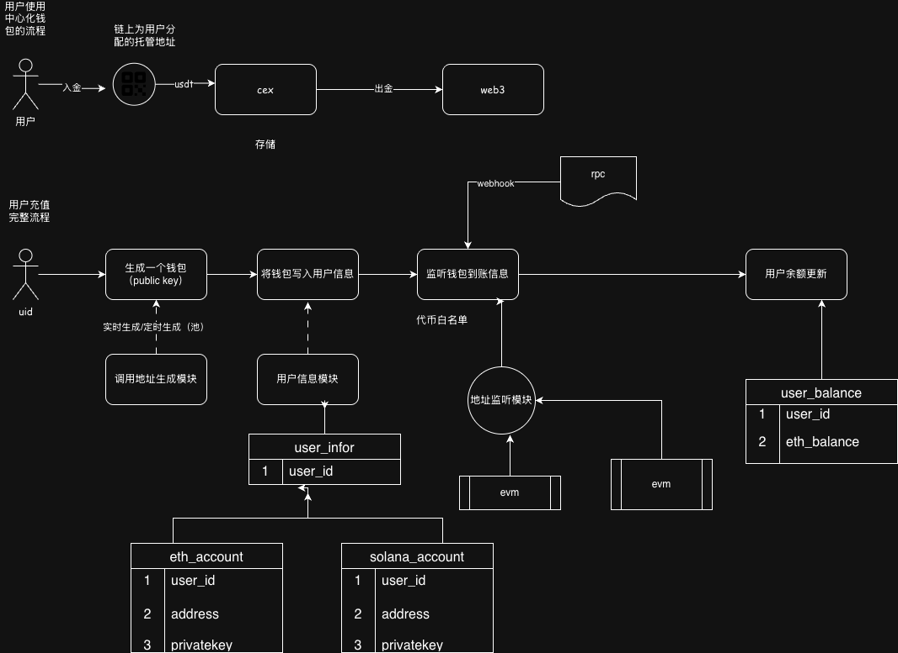
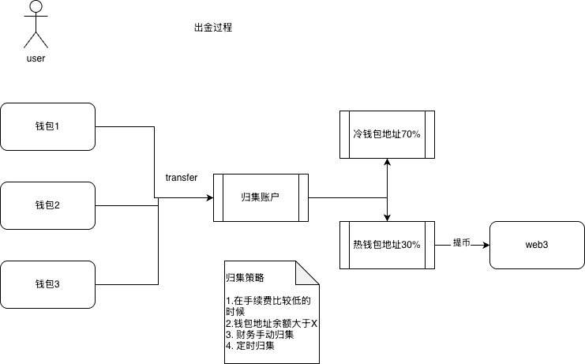

# 中心化钱包设计

中心化钱包是中心化交易所（CEX）的基础设施。CEX 的出现，显著降低了普通用户参与 Web3 的门槛——用户无需自行处理交易逻辑、管理私钥与公钥，也无需深入理解区块链确认机制与链上特性等专业知识。因此，在讲解 CEX 的业务流程之前，有必要先从系统层面理解中心化钱包的设计与运作方式。

## 去中心化钱包（Non-Custodial）

在中心化钱包出现之前，用户进入 Web3 通常只能使用去中心化钱包：例如浏览器插件 MetaMask（以太坊生态），或 Solana 上的 Phantom 等独立 App。

去中心化钱包的核心特点是**私钥由用户本地保管**。它本质上是连接本地客户端与链上网络的桥梁，负责签名与交互，**不承担**平台级的账务处理与用户账户体系管理。

## 中心化钱包（Custodial）

中心化钱包则采用**托管机制**：用户资产由交易所或托管方统一管理。用户不必关心资产存放在哪条链、如何保管密钥——平台在链下维护统一的账本与账户系统。

## 系统流程概览



## 用户视角：入金与出金

CEX 是连接用户与 Web3 世界的桥梁。用户无需了解资产在哪条链、如何管理私钥与公钥，即可通过托管机制使用 Web3 服务。

**主要流程：**

1. **分配托管地址** — CEX 为用户分配链上地址，私钥由平台保管，用户仅可见地址（公钥）
2. **入金（Deposit）** — 用户向托管地址充值代币
3. **链上识别与入账** — CEX 后台识别充值，更新用户账户余额（链下账本）
4. **出金（Withdraw）** — 用户将账户余额提取到自有链上地址

## 技术流程：入金

### 1. 用户注册与 UID 分配

用户注册账号后，中心化钱包为其分配 UID（用户唯一标识）。注册过程通常包含 KYC（身份证、营业执照等）。

### 2. 钱包生成与 UID 关联

用户选择某条链入金时，CEX 为其分配托管钱包：

- 用户只能看到 **public key（地址）**，看不到 **private key**
- 系统将钱包地址与 UID 关联，写入用户信息表
- 用户获得充值地址（二维码）后即可充值

### 3. 链上监听与余额更新

充值完成后，CEX 启动链上监听：

- 维护**代币白名单**（如 USDT、DOGE、ETH），仅白名单内代币到账会被识别
- 到账后写入用户信息表，更新用户余额

### 4. 核心模块

| 模块 | 职责 |
| :--- | :--- |
| **地址生成模块** | 为用户生成链上托管地址 |
| **用户信息模块** | 维护 UID、注册信息与各链地址的关联 |
| **链上监听模块** | 监听充值到账，更新账务 |
| **账务模块** | 维护用户各币种余额 |

#### 地址生成：实时生成 vs 地址池

**实时生成：** 用户选择链时即时生成地址。缺点：椭圆曲线密钥生成消耗 CPU，且需写库，延迟较高。

**地址池（推荐）：** 系统预生成一批地址存入地址池。当池中地址低于阈值时批量补充；用户充值时从池中分配未使用地址，无需实时计算。

#### 用户信息表结构（示意）

用户信息表关联 UID 与各链地址，包含：

- `uid` — 用户 ID
- `address` — 链上地址（对用户可见）
- `private_key` — 私钥（平台保管，用户不可见）

不同链（ETH、Solana、Bitcoin 等）地址格式与字段可能不同。

#### 链上监听的两种实现

**自建监听：** 直接监听 EVM、Solana 等链的区块/交易，需处理确认数、重组等逻辑。

**第三方 Webhook：** 使用 Alchemy、Helius 等 RPC 供应商的 Webhook 服务，到账时回调通知，降低自建成本。

到账确认后，更新账务表（用户 USDT、ETH 等余额）。

### 入金流程小结

```
注册 → 分配 UID → 选择链 → 分配托管地址 → 关联 UID
  → 用户充值 → 链上监听/Webhook → 更新余额
```

## 技术流程：归集与出金



### 资金分散与归集

用户真实代币分散在各托管地址中。为便于管理，CEX 会定期**归集（Sweep）**：将多个地址的代币 transfer 到统一地址。

- 地址少：逐笔转账
- 地址多：通过归集合约批量转移，节省 Gas

### 冷热钱包

归集后，资金通常拆分为：

| 类型 | 说明 | 典型比例 |
| :--- | :--- | :--- |
| **冷钱包** | 私钥由加密设备（U 盾、加密机）管理，离线存储，高管/财务管控 | 60–70% |
| **热钱包** | 在线地址，用于日常业务（如用户出金） | 剩余部分 |

### 归集策略

链上转账有 Gas 费。若地址余额不足以覆盖手续费，归集不划算。常见策略：

- Gas 较低时触发归集
- 地址余额超过阈值时触发归集
- 由财务手动归集，仅在需要动账时操作

### 出金（Withdraw）

用户发起提币时：

1. 从**热钱包**向用户指定的 Web3 地址转账
2. 从提币金额中扣除手续费

### 归集与出金流程小结

```
用户充值 → 分散在各托管地址 → 按策略归集 → 冷/热钱包
  → 用户出金时从热钱包转账 → 扣除手续费
```

> 不同钱包系统在账户处理、安全策略上可能有额外设计，但基本都经历归集过程。
