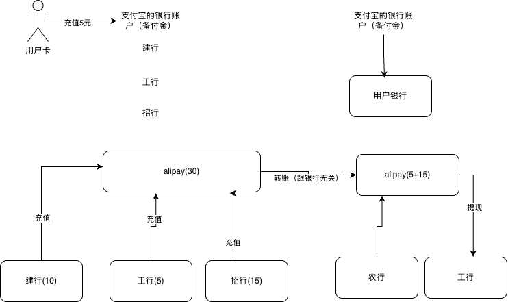
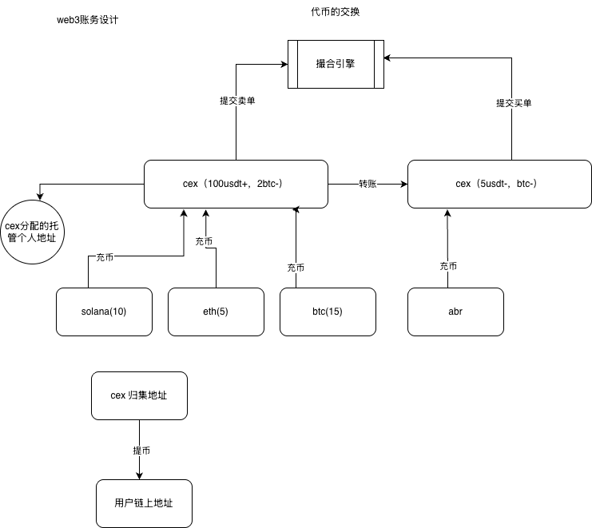

# 中心化钱包设计

中心化钱包是中心化交易所（CEX）的基础设施。CEX 的出现，显著降低了普通用户参与 Web3 的门槛——用户无需自行处理交易逻辑、管理私钥与公钥，也无需深入理解区块链确认机制与链上特性等专业知识。因此，在讲解 CEX 的业务流程之前，有必要先从系统层面理解中心化钱包的设计与运作方式。

## 去中心化钱包（Non-Custodial）

在中心化钱包出现之前，用户进入 Web3 通常只能使用去中心化钱包：例如浏览器插件 MetaMask（以太坊生态），或 Solana 上的 Phantom 等独立 App。

去中心化钱包的核心特点是**私钥由用户本地保管**。它本质上是连接本地客户端与链上网络的桥梁，负责签名与交互，**不承担**平台级的账务处理与用户账户体系管理。

## 中心化钱包（Custodial）

中心化钱包则采用**托管机制**：用户资产由交易所或托管方统一管理。用户不必关心资产存放在哪条链、如何保管密钥——平台在链下维护统一的账本与账户系统。

## 系统流程概览


## 用户视角：入金与出金

CEX 是连接用户与 Web3 世界的桥梁。用户无需了解资产在哪条链、如何管理私钥与公钥，即可通过托管机制使用 Web3 服务。

**主要流程：**

1. **分配托管地址** — CEX 为用户分配链上地址，私钥由平台保管，用户仅可见地址（公钥）
2. **入金（Deposit）** — 用户向托管地址充值代币
3. **链上识别与入账** — CEX 后台识别充值，更新用户账户余额（链下账本）
4. **出金（Withdraw）** — 用户将账户余额提取到自有链上地址

## 技术流程：入金

### 1. 用户注册与 UID 分配

用户注册账号后，中心化钱包为其分配 UID（用户唯一标识）。注册过程通常包含 KYC（身份证、营业执照等）。

### 2. 钱包生成与 UID 关联

用户选择某条链入金时，CEX 为其分配托管钱包：

- 用户只能看到 **public key（地址）**，看不到 **private key**
- 系统将钱包地址与 UID 关联，写入用户信息表
- 用户获得充值地址（二维码）后即可充值

### 3. 链上监听与余额更新

充值完成后，CEX 启动链上监听：

- 维护**代币白名单**（如 USDT、DOGE、ETH），仅白名单内代币到账会被识别
- 到账后写入用户信息表，更新用户余额

### 4. 核心模块

| 模块 | 职责 |
| :--- | :--- |
| **地址生成模块** | 为用户生成链上托管地址 |
| **用户信息模块** | 维护 UID、注册信息与各链地址的关联 |
| **链上监听模块** | 监听充值到账，更新账务 |
| **账务模块** | 维护用户各币种余额 |

#### 地址生成：实时生成 vs 地址池

**实时生成：** 用户选择链时即时生成地址。缺点：椭圆曲线密钥生成消耗 CPU，且需写库，延迟较高。

**地址池（推荐）：** 系统预生成一批地址存入地址池。当池中地址低于阈值时批量补充；用户充值时从池中分配未使用地址，无需实时计算。

#### 用户信息表结构（示意）

用户信息表关联 UID 与各链地址，包含：

- `uid` — 用户 ID
- `address` — 链上地址（对用户可见）
- `private_key` — 私钥（平台保管，用户不可见）

不同链（ETH、Solana、Bitcoin 等）地址格式与字段可能不同。

#### 链上监听的两种实现

**自建监听：** 直接监听 EVM、Solana 等链的区块/交易，需处理确认数、重组等逻辑。

**第三方 Webhook：** 使用 Alchemy、Helius 等 RPC 供应商的 Webhook 服务，到账时回调通知，降低自建成本。

到账确认后，更新账务表（用户 USDT、ETH 等余额）。

### 入金流程小结

```
注册 → 分配 UID → 选择链 → 分配托管地址 → 关联 UID
  → 用户充值 → 链上监听/Webhook → 更新余额
```

## 技术流程：归集与出金


### 资金分散与归集

用户真实代币分散在各托管地址中。为便于管理，CEX 会定期**归集（Sweep）**：将多个地址的代币 transfer 到统一地址。

- 地址少：逐笔转账
- 地址多：通过归集合约批量转移，节省 Gas

### 冷热钱包

归集后，资金通常拆分为：

| 类型 | 说明 | 典型比例 |
| :--- | :--- | :--- |
| **冷钱包** | 私钥由加密设备（U 盾、加密机）管理，离线存储，高管/财务管控 | 60–70% |
| **热钱包** | 在线地址，用于日常业务（如用户出金） | 剩余部分 |

### 归集策略

链上转账有 Gas 费。若地址余额不足以覆盖手续费，归集不划算。常见策略：

- Gas 较低时触发归集
- 地址余额超过阈值时触发归集
- 由财务手动归集，仅在需要动账时操作

### 出金（Withdraw）

用户发起提币时：

1. 从**热钱包**向用户指定的 Web3 地址转账
2. 从提币金额中扣除手续费

### 归集与出金流程小结

```
用户充值 → 分散在各托管地址 → 按策略归集 → 冷/热钱包
  → 用户出金时从热钱包转账 → 扣除手续费
```

> 不同钱包系统在账户处理、安全策略上可能有额外设计，但基本都经历归集过程。

## 中心化钱包账务设计

中心化钱包的账务系统，核心要解决**多链、多代币**场景下的余额流转问题。

### 设计挑战

同一用户可能同时在多条链上持有资产，例如 Solana、Bitcoin、Arbitrum、Ethereum；每条链上又有多种代币（如 DOGE、USDT、ETH 等）。账务系统需要在链下统一维护「用户在某个币种上的可用余额」，并正确处理充值、冻结、划转、出金等流转，而不让用户感知底层链与地址的复杂性。

### 设计思路：参考 Web2 余额账户

中心化钱包的账务设计，可类比 Web2 支付中的**余额账户 + 多来源入金**模型。

以支付宝为例：用户拥有一个 Alipay 余额账户，可以从建行卡、工行卡、招商银行卡等不同来源充值。支付宝并不需要让用户理解每张银行卡的内部清算细节，而是在用户侧呈现统一的「余额」，在系统侧分别记录：

- **余额账户** — 用户看到的可用金额（链下账本）
- **入金来源** — 哪张银行卡、哪笔转账、何时到账（链上地址、哪条链、哪种代币）
- **币种/账户维度** — 不同业务线可能拆分不同子账户（对应 CEX 中不同链、不同代币的余额字段）

CEX 中的对应关系：

| Web2（支付宝） | CEX（中心化钱包） |
| :--- | :--- |
| 支付宝余额账户 | 用户 UID 下的链下账务余额 |
| 建行卡 / 工行卡充值 | 不同链、不同托管地址的链上入金 |
| 银行卡号 | 链上充值地址 |
| 人民币 | 具体代币种类（USDT、ETH、DOGE 等） |
| 银行转账到账通知 | 链上监听 / Webhook 到账回调 |

用户从 Solana 充入 USDT、从 Ethereum 充入 ETH，在 CEX 侧都应归集到同一 UID 下对应币种的余额字段；账务系统负责「链上到账 → 链下记账」的映射，而非让用户分别管理各链钱包。

### 支付宝充值机制：备付金与清结算

银行卡余额与支付宝余额分属不同系统，无法直接「扣减银行卡、增加支付宝余额」。异构系统之间的资金变动，在账户/交易系统中称为**清结算**。

支付宝在各银行（建行、工行、招行等）开设**备付金账户**。用户充值时，实际发生的是：

```
用户银行卡 → 转账 → 支付宝在该行的备付金账户
银行通知支付宝到账 → 支付宝增加用户链下余额
```

**示例：** 用户 A 从建行充 10 元、工行充 5 元、招行充 15 元，支付宝余额变为 30 元。背后是三笔「用户银行卡 → 支付宝备付金」的银行转账，以及三次链下余额增加——并非资金在系统间直接搬运。

### 支付宝内部流转

备付金入账、余额增加后，用户之间的操作**不再涉及银行**：

| 操作 | 本质 |
| :--- | :--- |
| **用户 A 向 B 转账 5 元** | A 余额 −5，B 余额 +5（数据库记账） |
| **购买服务** | 同上，平台内部余额变动 |

用户 B 提现 10 元到工行卡时，支付宝从备付金向 B 的银行卡转账——这是与银行的**第二次交互**。

### 支付宝与银行的两处交互

```
充值：用户银行卡 → 支付宝备付金 → 用户余额 +N
      ↑ 第一次与银行交互

内部：用户间转账、消费 → 仅支付宝内部账本变动

提现：支付宝备付金 → 用户银行卡
      ↑ 第二次与银行交互
```

> 以上为教学简化模型；实际支付机构在备付金管理、跨行清算、合规等方面会更复杂。

### 支付宝模型核心提炼



**三层逻辑：**

1. **异构入金** — 多银行（多来源）→ 备付金 → 统一余额账户
2. **内部记账** — 用户间转账、消费仅在平台账本内增减
3. **异构出金** — 余额 → 备付金 → 用户银行账户

---

### 对标 CEX：Web3 多链账务设计

将支付宝模型映射到 CEX：**CEX 即 Web3 世界的「支付宝」**，各条链即「不同银行」。

| Web2（支付宝） | Web3（CEX 中心化钱包） |
| :--- | :--- |
| 支付宝余额账户 | 用户 UID 下的链下账务余额 |
| 建行 / 工行 / 招行 | Solana / Ethereum / Bitcoin 等链 |
| 银行卡号 | 用户托管充值地址 |
| 备付金账户 | 交易所归集地址 / 热钱包 |
| 银行到账通知 | 链上监听 / Webhook |
| 人民币 | USDT、BTC、ETH 等代币 |



#### 充币（Deposit）

1. CEX 为用户分配**托管充值地址**（私钥由平台保管）
2. 用户从自有 Web3 钱包向该地址转入代币（如 100 USDT）
3. CEX 监听到账后，在用户 UID 下对应币种余额 **+100**

不同链的充币流程与支付宝「不同银行 → 备付金 → 余额增加」逻辑一致。

#### 同币种转账（Transfer）

用户 A 向用户 B 转 USDT：**同币种余额转移**，仅链下账本变动，不涉及链上操作。

```
A 的 USDT 余额 −N
B 的 USDT 余额 +N
```

#### 不同代币交换（撮合）

用户 A 有 BTC 想换 USDT，用户 B 有 USDT 想换 BTC：

- A 提交**卖单**，B 提交**买单**
- **撮合引擎**在订单池中匹配价格满足的两笔订单
- 成交后账务系统更新：
  - A：BTC −，USDT +
  - B：USDT −，BTC +

> **转账** = 同币种转移；**撮合** = 不同代币交换（详见 [05-matching-engine.md](./05-matching-engine.md)）。

#### 提币（Withdraw）

用户 B 提币时，CEX 从**归集地址 / 热钱包**向用户指定的链上地址转账，对应支付宝「备付金 → 用户银行卡」的出金逻辑。

### 账务设计小结

```
充币：用户链上地址 → 托管地址 → 链下余额 +N     （与链交互）
内部：同币种转账 / 撮合成交 → 链下账本增减        （链下记账）
提币：归集/热钱包 → 用户链上地址               （与链交互）
```

CEX 维护一套链下账本，每个 UID 按币种记录余额。充提两次与链交互，中间交易（转账、撮合）均在链下完成——这与支付宝「两次与银行交互、中间内部记账」的模式同构。
