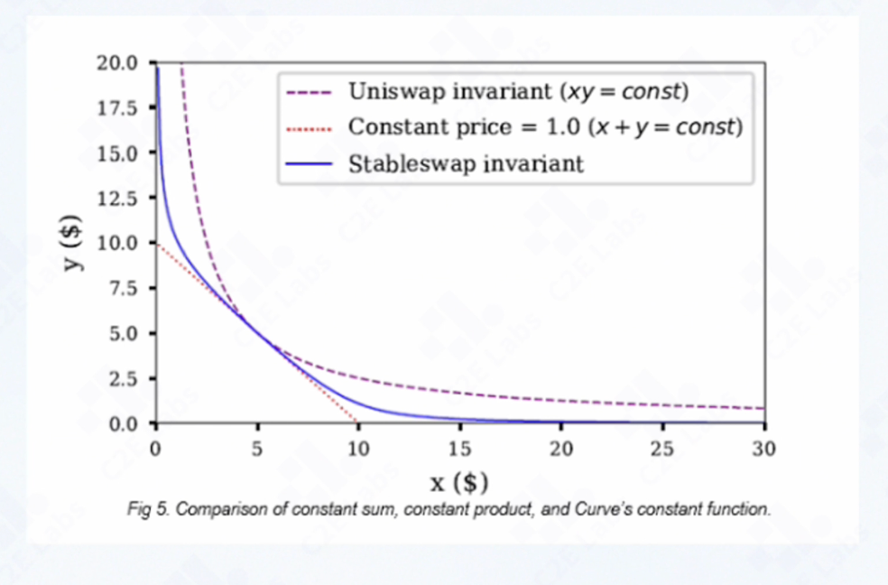
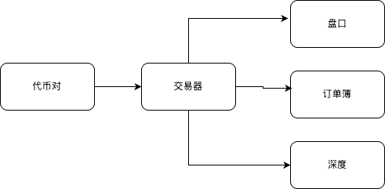
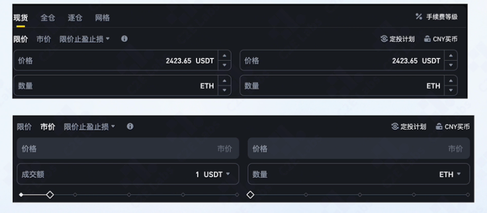

# 订单簿（Order Book）深度解析

## 从 DEX 到 CEX：定价方式的差异

### DEX：AMM 自动做市



DEX 没有中心化机构撮合，价格由链上智能合约中的 **AMM（自动做市商）** 算法决定。常见类型：

| 类型 | 特点 | 应用场景 |
| :--- | :--- | :--- |
| **恒定和做市** | 固定兑换比例 | 早期方案，现已少见 |
| **稳定币做市** | 大部分区间内汇率锚定 1:1，池子接近耗尽时价格陡升 | USDC/USDT 等稳定币对 |
| **恒定乘积做市** | 两种代币存量乘积为常数；一种变少、另一种变多，稀缺方涨价 | Uniswap 等主流 DEX |

AMM **无法算出代币的「真实公允价」**——实际价格受宏观经济、政策、市场事件等影响，是市场博弈的结果。AMM 的作用是通过数学公式**模拟、逼近**现货市场的兑换关系。

### CEX：订单簿 + 撮合引擎

CEX 依托后台撮合系统，**不再依赖 AMM 定价**。市场价由买卖双方共同形成：

- 买方挂**买单**，卖方挂**卖单**
- 系统按最优报价自动撮合，成交即完成一笔交易

**最优报价规则：**

| 方向 | 最优价 | 含义 |
| :--- | :--- | :--- |
| 买单 | **最高买价** | 买方愿意出的最高价，最容易与卖单匹配 |
| 卖单 | **最低卖价** | 卖方愿意接受的最低价，最容易与买单匹配 |

**订单簿**即归集全市场未成交委托的结构化数据：

- **卖单（asks）**：按报价**由低到高**排序 → 队首为最优卖一
- **买单（bids）**：按报价**由高到低**排序 → 队首为最优买一

当最优买价 ≥ 最优卖价时，系统自动匹配，撮合成功后完成资金与标的交割。

---

## 交易币对（Trading Pair）

代币对



**币对**表示 CEX 支持的两种代币兑换关系，例如 `BTC/USDT` 表示平台支持 BTC 与 USDT 互相兑换。

### 基准币种（Base / Quote）

以 `BTC/USDT` 为例，**Quote（计价币）** 为 USDT：

| 操作 | 含义 |
| :--- | :--- |
| **买入 BTC** | 花费 USDT，获得 BTC |
| **卖出 BTC** | 卖出 BTC，换回 USDT |

交易所后台通常用配置表维护：

- 全平台上线币对列表
- 各币对的基准 / 计价币种
- 交易手续费率（成交后自动扣除，归集至平台账户）

部分交易所会有阶梯费率等复杂规则，底层逻辑一致。

配置完成后，CEX **按单个币对独立创建撮合引擎**，负责接收前端下单请求并完成订单匹配。围绕引擎延伸出盘口、订单簿、交易深度等概念。

---

## 限价单与市价单

> **术语说明：** 「限价盘 / 市价盘」与「限价单 / 市价单」指同一类委托类型，「盘」多见于港股市场表述，「单」为 CEX 常用说法。下文两种说法混用。**盘口**则是订单簿的可视化展示，与此处不同。

### 限价盘（Limit Order）

**(1) 买单：** 以 **x** 价格（USDT）买入 **y**（手动输入）的 ETH，使用的 USDT 不超过持有量，共消耗 **x × y** USDT。

> 例：我愿意以 100 元的价格买 6 个苹果。如果这个价格**高于**市场价，就会很快成交；反之如果这个价格**远低于**市场价，就没有卖家愿意接单。

**(2) 卖单：** 以 **x** 价格（USDT）卖出 **y**（手动输入）的 ETH，最多卖出不超过持有量的 ETH；若成交成功，得到 **x × y** USDT。

> 例：我愿意以 50 元的价格卖出 4 个苹果。如果这个价格**低于**市场价，就会很快成交；反之如果这个价格**远高于**市场价，就没有买家愿意接单。

### 市价盘（Market Order）

**(1) 买单：** 以市场价花费最高不超过余额数目的 USDT（**成交额**），购买尽可能多的 ETH。

**(2) 卖单：** 以市场价卖出指定数量（手动输入）的 ETH，使用数量不超过持有的 ETH。

### 剩余可交易数量计算

因此，计算当前类型可交易数量为：

| 订单类型 | 计算方式 |
| :--- | :--- |
| **限价买单** | 剩余数量 = 总量 − 已成交量 |
| **市价买单** | 剩余金额 ÷ 当前成交价 → 可得数量 |
| **限价卖单** | 剩余数量 = 总量 − 已成交量 |
| **市价卖单** | 剩余数量 = 总量 − 已成交量 |

> **关键总结：** 除**市价买单填成交额**外，限价买卖单、市价卖单均填写**代币数量**；剩余仓位计算仅市价买单不同。

### 交易界面示意



| 模式 | 价格字段 | 数量 / 金额字段 |
| :--- | :--- | :--- |
| **限价** | 用户输入，如 2423.65 USDT | 用户输入 ETH 数量 |
| **市价** | 锁定为「市价」，不可编辑 | 买入填成交额（USDT）；卖出填数量（ETH） |

---

## 订单簿数据结构

订单簿反映当前交易者的挂单意愿，但尚未实际成交。

```json
{
  "asks": [ { "price": 100.5, "amount": 1.2 }, ... ],
  "bids": [ { "price": 100.0, "amount": 0.8 }, ... ]
}
```

| 字段 | 含义 | 排序 |
| :--- | :--- | :--- |
| `asks` | 卖盘（红色） | 价格由低到高 |
| `bids` | 买盘（绿色） | 价格由高到低 |

---

## 盘口（Plate）

盘口是订单簿的**前端可视化展示**，通常只展示最优 N 档买卖报价（常见 5 档 / 10 档）。

| 组成部分 | 说明 |
| :--- | :--- |
| **价格** | 当前档位的报价 |
| **数量** | 该价位的代币挂单量 |
| **合计数量** | 从当前档位到最优档的累计挂单量 |
| **最近成交价** | 相较上次涨跌 |

**同一价格的多个订单会合并展示。**

布局示意：

```
卖盘（asks）  ← 价格由低到高，靠近中间的是最优卖一（最低卖价）
──────────────  价差 / 最新成交价
买盘（bids）  ← 价格由高到低，靠近中间的是最优买一（最高买价）
```

用户下单后，交易引擎将订单写入订单簿并更新盘口，前端实时刷新买卖挂单列表。

### 买盘合计数量计算示例

以买盘某档位为例，合计 = 当前价格及以上各档数量之和：

```
档位 100.0：22
档位  99.5：1096  →  合计 1118
档位  99.0：22    →  合计 1140
```

深色进度条通常表示当前档位数量占买盘/卖盘总量的百分比：

```
占比 = item.amount / plate.bidTotal × 100%
```

---

## 交易深度（Depth）

### 深度的概念

**深度**反映市场在不同价格水平上的订单数量，是**流动性的重要指标**。

某一交易对在不同价格档位上的挂单越多、越分散，深度越好，大单成交时对价格的冲击越小；反之则称「深度不够」，通常指：

1. **价格档位少** — 可成交的报价区间跨度小
2. **同价位挂单单薄** — 每个价格档位的资金 / 代币数量少

> 例：5 USDT 价位有大量买单，4.9、5.1 等相邻价位同样有大额挂单 → 深度厚实、流动性好；反之仅一档有价 → 深度匮乏。

### 深度特点

| 维度 | 说明 |
| :--- | :--- |
| **价格层级** | 每个价格水平上的总订单量（同价订单合并后的挂单量） |
| **累计深度** | 从最优价格到当前价格的累计订单量（盘口「合计」列即为此） |
| **实时更新** | 随新订单、撤单、成交动态调整，需与订单簿同步推送 |

### 深度计算逻辑

深度信息通过对订单簿聚合计算得到。撮合引擎通常用 **map + 有序价格切片** 维护买卖队列，按价格档位累加（Go 无内置有序 map，需额外维护排序）：

```go
type MergeOrder struct {
	Price  decimal.Decimal // 价格档位
	Amount decimal.Decimal // 该价位合并后的总量
}

// 买单深度：从最高价（最优买一）开始累计
buyQueue := buyLimitPriceQueue // map[string]*MergeOrder，key 为价格
// buyPrices 按价格降序排列，遍历 buyPrices 逐档累加得累计深度

// 卖单深度：从最低价（最优卖一）开始累计
sellQueue := sellLimitPriceQueue // map[string]*MergeOrder
// sellPrices 按价格升序排列，遍历 sellPrices 逐档累加得累计深度
```

- **买盘**：`buyPrices` 降序，从最优买价向外逐档累加 → 得到各档**累计深度**
- **卖盘**：`sellPrices` 升序，从最优卖价向外逐档累加 → 得到各档**累计深度**

与盘口展示的关系：

```
档位 100.0：22          →  该价格层级订单量
档位  99.5：1096  → 1118  →  累计深度（100.0 + 99.5）
档位  99.0：22    → 1140  →  累计深度（至 99.0）
```

前端深度图、进度条占比等，均基于上述聚合结果渲染。

---

## 订单簿更新与推送

订单簿数据需实时同步至前端，常见方案：

1. 最新盘口变更写入消息队列
2. 后端计算挂单信息（合并同价、累计深度等）
3. 通过 **WebSocket**（如 STOMP / Socket.IO）推送给客户端，前端刷新盘口与深度图

---

## 本章小结

```
币对配置 → 按币对创建撮合引擎
         → 用户下限价单 / 市价单
         → 订单进入订单簿（bids / asks）
         → 最优买卖价匹配 → 撮合成交
         → 盘口 / 深度实时推送至前端
```
