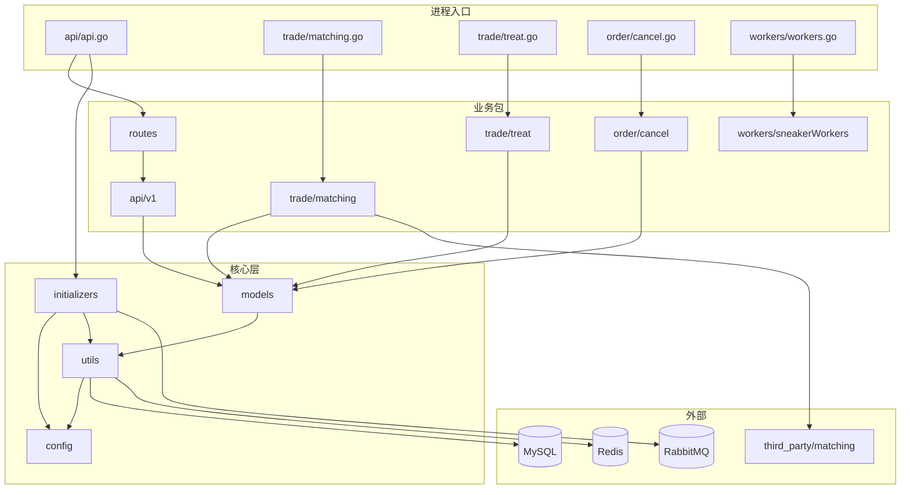

# 目录结构说明

本文说明 go-cex 的目录排布逻辑、各目录职责，以及复刻时如何组织同类项目。

---

## 一、顶层目录树

```text
go-cex/
├── api/                        # HTTP API 层
│   ├── api.go                  # API 进程 main：Echo 启动、初始化、优雅退出
│   └── v1/                     # REST handler，按资源拆分
│       ├── currency.go
│       ├── market.go
│       ├── order.go
│       ├── orderBook.go        # 深度
│       ├── kLine.go
│       ├── ticker.go
│       ├── trade.go
│       └── user.go
│
├── routes/                     # 路由注册（与 handler 解耦）
│   └── v1.go
│
├── models/                     # 领域模型 + 数据库迁移
│   ├── common.go               # AutoMigrations 入口
│   ├── user.go / identity.go
│   ├── account.go / accountVersion.go
│   ├── currency.go / market.go
│   ├── order.go / trade.go
│   ├── k.go / ticker.go
│   └── token.go / apiToken.go / device.go
│
├── config/                     # 配置加载（Go struct + YAML 文件）
│   ├── env.go / env.yml
│   ├── database.yml
│   ├── redis.yml
│   ├── amqp.go / amqp.yml
│   ├── workers.go / workers.yml
│   └── *.yml.example           # 配置模板
│
├── initializers/               # 应用启动时的「装配」逻辑
│   ├── auth.go                 # JWT/Token 中间件
│   ├── rabbitmq.go             # AMQP 连接与交换机声明
│   ├── cacheData.go            # 市场/币种内存缓存
│   ├── i18n.go                 # 多语言
│   ├── latestKLine.go / ticker.go
│   ├── initializeWorkers.go    # Worker 注册
│   ├── filters.go              # 请求参数解析
│   └── locales/                # 错误码、钱包文案
│
├── utils/                      # 跨模块基础设施（无业务语义）
│   ├── gorm.go                 # 主库/备库、事务封装
│   ├── redis.go                # Redis 连接池与 helper
│   ├── response.go             # 统一 JSON 响应
│   ├── helper.go
│   ├── config.go
│   ├── uploadToS3.go / uploadToQiniu.go
│   └── randString.go
│
├── trade/                      # 交易相关后台进程
│   ├── matching.go             # 撮合进程 main
│   ├── treat.go                # 成交结算进程 main
│   ├── matching/               # 撮合业务包
│   │   ├── base.go             # 市场分配、MQ 消费、引擎初始化
│   │   ├── depth.go            # 深度写 Redis
│   │   ├── trade.go            # 撮合结果处理
│   │   └── worker.go
│   └── treat/                  # 成交结算业务包
│       ├── base.go
│       └── worker.go
│
├── order/                      # 撤单相关（独立进程）
│   ├── cancel.go               # 撤单进程 main
│   └── cancel/
│       ├── base.go
│       └── worker.go
│
├── workers/                    # 通用异步 Worker 进程
│   ├── workers.go              # main：按配置启动多 goroutine 消费
│   └── sneakerWorkers/         # 各 Worker 实现
│       ├── kLineWorker.go
│       ├── tickerWorker.go
│       ├── rebuildkLineToRedisWorker.go
│       └── accountVersionWorker.go
│
├── schedules/                  # 定时任务进程（可选）
│   ├── schedule.go
│   ├── kLine/create.go
│   ├── order/waitingCheck.go
│   └── backup/tasks/
│
├── third_party/                # 本地 replace 的第三方库
│   └── matching/               # 撮合引擎（订单簿、Engine）
│
├── docker/                     # 容器专用配置与初始化 SQL
│   ├── config/
│   ├── mysql/init/
│   └── start-service.sh
│
├── scripts/                    # 运维与演示脚本
│   ├── seed_demo_data.sh / .sql
│   └── reset_demo_state.sh
│
├── cmd/                        # build.sh 输出的二进制（gitignore 常见）
├── logs/                       # 运行时日志
├── pids/                       # 进程 PID 文件
├── docs/                       # README 用截图（非开发文档）
├── doc/                        # 本复刻指南文档目录
│
├── build.sh / start.sh / stop.sh / restart.sh
├── docker-compose.yml
├── Dockerfile
├── go.mod / go.sum
└── README.md
```

---

## 二、设计原则：为什么这样排

### 1. 「一个 main 包 = 一个 OS 进程」

Go 项目用**目录 + 多个 main** 表达微服务拆分，而不是单一 monolith：

| main 入口 | 目录位置 | 编译输出 |
|-----------|----------|----------|
| API | `api/api.go` | `cmd/api` |
| 撮合 | `trade/matching.go` | `cmd/matching` |
| 成交 | `trade/treat.go` | `cmd/treat` |
| 撤单 | `order/cancel.go` | `cmd/cancel` |
| Worker | `workers/workers.go` | `cmd/workers` |
| 定时 | `schedules/schedule.go` | （通常 go run） |

**复刻建议**：早期可以把 matching/treat/cancel 合在一个进程里简化调试，稳定后再拆分为独立 main，与 MQ 边界对齐。

### 2. 「业务包 / 进程入口」分离

以撮合为例：

- `trade/matching.go` — 只做 `initialize()`、`InitAssignments()`、信号处理
- `trade/matching/base.go` — 真正业务逻辑，可被测试 import

这样 **main 薄、package 厚**，便于单元测试与 reuse。

### 3. models 集中，handlers 薄

- 所有 Gorm 模型与 `AutoMigrations` 在 `models/`
- `api/v1/*.go` 只做参数解析、调用 model/utils、返回 JSON
- 复杂账务逻辑在 order API 的 helper 或 treat/cancel 包中

### 4. config 与 initializers 分工

| 层 | 职责 |
|----|------|
| `config/` | 读 YAML → 全局变量（`CurrentEnv`、`AmqpGlobalConfig`） |
| `initializers/` | 副作用初始化：连 MQ、加载 i18n、预热 Redis 缓存、注册 Worker |

**原则**：config 不含业务；initializers 在 main 启动时按顺序调用。

### 5. utils 保持「 dumb 工具」

数据库、Redis、HTTP 响应、上传等放 `utils/`，避免与 `models` 循环依赖。业务错误码通过 `utils.BuildError("1020")` 与 i18n 配合。

### 6. third_party 本地化关键依赖

撮合引擎通过 `go.mod` 的 `replace` 指向 `./third_party/matching`：

- 避免上游模块失效
- 方便课程内修改撮合行为
- 复刻时可替换为自研 engine，接口保持 `Submit(order)` 即可

### 7. docker/ 与 config/ 双份配置

| 场景 | 配置路径 |
|------|----------|
| 本地 bare metal | 项目根 `config/*.yml`（127.0.0.1） |
| Docker Compose | `docker/config/*.yml`（服务名 mysql/redis/rabbitmq） |

避免在代码里写死连接串，**环境差异只改 YAML**。

---

## 三、各目录依赖关系



**依赖规则**：

- `models` → 只依赖 `utils`（不依赖 api/trade）
- `api/v1` → `models` + `utils` + `config` + `initializers`
- `trade/matching` → `models` + `utils` + `config` + `matching` 引擎
- 禁止 `models` import `api`（避免循环）

---

## 四、Market 模型的「节点字段」与目录对应

`models/market.go` 中几个字段决定消息被哪个进程消费：

| 字段 | 消费者进程 | 代码位置 |
|------|------------|----------|
| `matching_node` | matching | `trade/matching/base.go` InitAssignments |
| `trade_treat_node` | treat | `trade/treat/base.go` |
| `order_cancel_node` | cancel | `order/cancel/base.go` |

单机演示时 `env.yml` 的 `node: a` 与市场表里的 node 字段一致即可。扩展多机时，不同机器启动不同 node 的进程，实现**按市场水平扩展**。

---

## 五、消息与队列命名（跨目录约定）

配置在 `config/amqp.yml`，业务命名在 `models/market.go` 的方法：

| 概念 | 典型命名模式 |
|------|--------------|
| 撮合交换机 | 每市场 topic exchange |
| 撮合队列 | `{market}.matching` |
| 成交交换机 | `{market}.trade.treat` |
| 撤单交换机 | `{market}.order.cancel` |
| reload 队列 | `goDCE.reload.trade.matching` 等 |
| K 线 Worker | exchange `goDCE.default`, key `goDCE.k` |
| Ticker Worker | key `goDCE.ticker` |

**复刻建议**：先实现硬编码单市场队列，再抽象为 Market 方法 + YAML 配置。

---

## 六、复刻时的目录裁剪建议

### 最小可运行版本（MVP）

保留：

```text
api/ routes/ models/ config/ initializers/ utils/
trade/matching.go trade/matching/ trade/treat.go trade/treat/
order/cancel.go order/cancel/
third_party/matching/
scripts/ build.sh start.sh
```

可暂缓：

```text
workers/          # 深度可仅来自 matching
schedules/        # 手动补数据即可
utils/upload*     # 无 S3 需求可删
initializers/locales/  # 可先硬编码中文错误
docker/           # 本地装中间件即可
```

### 命名建议（新项目）

若不复用 `goDCE` 命名，建议统一替换：

| 原名称 | 建议 |
|--------|------|
| goDCE 数据库 | `my_cex` / `my_cex_backup` |
| go.mod module | `github.com/you/my-cex` |
| AMQP routing key 前缀 | `mycex.*` |
| 演示用户域名 | 自定义 |

---

## 七、与常见 Go 项目布局的对比

| 模式 | go-cex 做法 | 说明 |
|------|-------------|------|
| cmd/ 放 main | main 散落在 api/、trade/ 等 | 用 build.sh 统一输出到 cmd/ |
| internal/ | 未使用，业务包直接公开 | 课程项目简化；生产建议 `internal/trade` |
| pkg/ | 无 | utils 承担 pkg 角色 |
| api/ | HTTP handler | 符合常见语义 |
| 配置 | YAML 文件 + config 包 | 非环境变量优先 |

复刻生产项目时，可将 `trade/matching`、`trade/treat`、`order/cancel` 移入 `internal/`，仅保留 `cmd/api`、`cmd/matching` 等薄入口。

---

## 八、关键文件速查

| 想了解… | 打开 |
|---------|------|
| 有哪些 HTTP 接口 | `routes/v1.go` |
| 表结构 | `models/common.go` AutoMigrations |
| 下单冻结逻辑 | `api/v1/order.go` |
| 撮合消费 | `trade/matching/base.go` |
| 成交入账 | `trade/treat/worker.go` |
| 撤单解冻 | `order/cancel/worker.go` |
| K 线聚合 | `workers/sneakerWorkers/kLineWorker.go` |
| AMQP 拓扑 | `config/amqp.yml` + `initializers/rabbitmq.go` |
| 鉴权 | `initializers/auth.go` |
