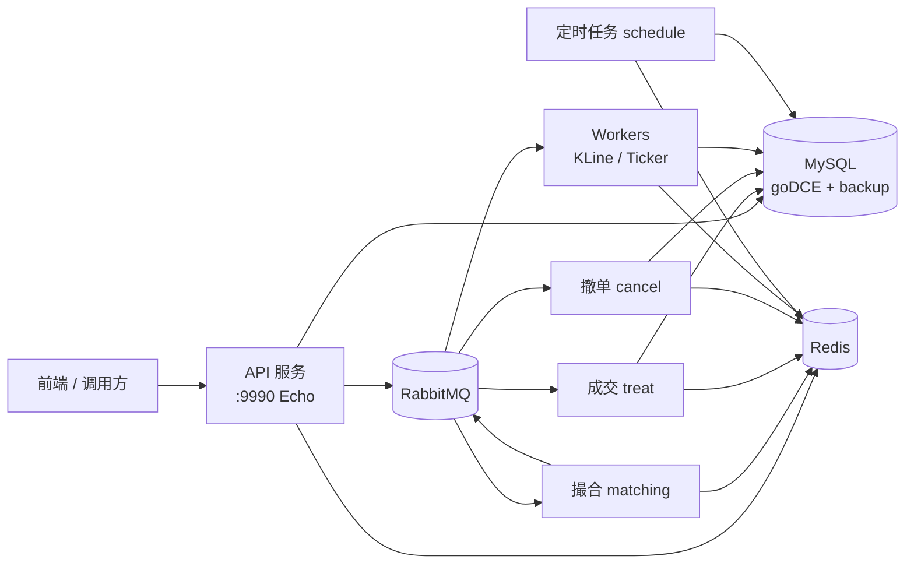

# go-cex 项目分析与复刻指南

本文档基于 `go-cex`（原 goDCE）仓库的实际代码结构整理，面向「从零复刻一个同类 CEX 后端」的学习与开发场景。

---

## 文档索引

| 文档 | 内容 |
|------|------|
| [01-setup-workflow.md](./01-setup-workflow.md) | 搭建整体流程：环境、配置、编译、启动、验证 |
| [02-feature-roadmap.md](./02-feature-roadmap.md) | 现有功能清单与推荐实现顺序 |
| [03-directory-structure.md](./03-directory-structure.md) | 目录结构排布与设计原则 |

---

## 项目一句话定位

**go-cex 是一个教学演示用的中心化交易所（CEX）币币交易后端**：采用 Go 多进程架构，通过 RabbitMQ 解耦 API、撮合、成交结算、撤单与行情 Worker，MySQL 持久化账务，Redis 缓存深度 / K 线 / Ticker。

> 注意：这是课程样板工程，不是开箱即用的生产系统。复刻时应先跑通主链路，再逐步补齐运维与风控能力。

---

## 系统架构速览

---

## 五个独立进程

| 进程 | 入口 | 编译产物 | 职责 |
|------|------|----------|------|
| API | `api/api.go` | `cmd/api` | HTTP 接口、鉴权、下单/查单、公开行情 |
| 撮合 | `trade/matching.go` | `cmd/matching` | 消费订单消息、内存撮合、输出成交/撤单事件 |
| 成交 | `trade/treat.go` | `cmd/treat` | 消费成交消息、更新订单与账户 |
| 撤单 | `order/cancel.go` | `cmd/cancel` | 消费撤单消息、释放冻结资金 |
| Worker | `workers/workers.go` | `cmd/workers` | K 线、Ticker、账户版本检查等异步任务 |

另有可选进程：**定时任务** `schedules/schedule.go`（日志备份、Token 清理、K 线补算、待成交检查）。

---

## 技术栈

| 类别 | 选型 |
|------|------|
| 语言 | Go 1.13+（Docker 构建使用 1.22） |
| Web 框架 | Echo v3 |
| ORM | Gorm v1 |
| 数据库 | MySQL 8（主库 + backup 库） |
| 缓存 | Redis（redigo） |
| 消息队列 | RabbitMQ（streadway/amqp） |
| 异步 Worker | sneaker-go v3 |
| 定时任务 | robfig/cron |
| 精度计算 | shopspring/decimal |
| 撮合引擎 | third_party/matching（本地 replace） |

---

## 与 C2E-CEX-usdt-wallet 的关系

| 项目 | 定位 |
|------|------|
| **go-cex** | Go 实现的精简 CEX 后端，聚焦币币交易核心链路 |
| **C2E-CEX-usdt-wallet** | Java 微服务完整版 + Vue 前端 + Hardhat 钱包链，功能更广（钱包充值/提币、合约等） |

若目标是「复刻 go-cex 这类项目」，建议以 go-cex 为后端蓝本；若需要完整 UI 与链上钱包，再对接或参考 `C2E-CEX-usdt-wallet/cex-front`。
